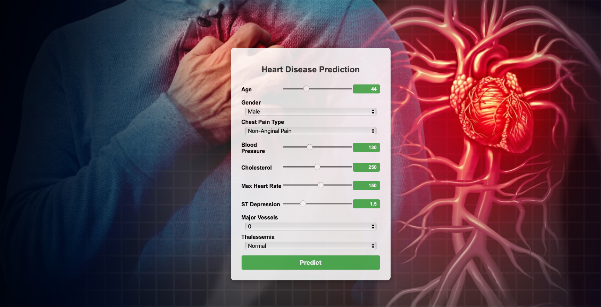

# Cardiovascular Disease Prediction

## Tools
- NumPy
- Pandas
- Scikit-learn
- Django

## Installation

Create a virtual environment and install the dependencies.

In macOS and Linux:
```zsh
python3 -m venv venv
source venv/bin/activate
```
In Windows:

```zsh
python3 -m venv venv
.\venv\Scripts\activate
```

Install dependecies
```zsh
# pip3 install pandas scikit-learn joblib
# pip3 freeze > requirements.txt
pip3 install -r requirements.txt
```

### How to run Project ( Web App)?
```zsh
python3 manage.py runserver
```

### Input
<!--  -->


### Output

<center>
  
</center>


### How to train model?

```zsh
python3 train/model.py 
```

### How to run trained model?

```zsh
python3 train_script.py
```
